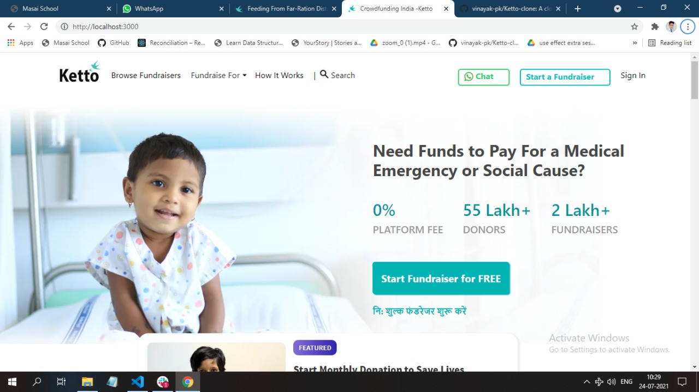

# Ketto - Website Clone - Project Work

[![gaming](data:image/jpeg;base64,/9j/4AAQSkZJRgABAQAAAQABAAD/2wCEAAkGBxMQERASDxMWFhUVGBURFRgVFRIVFhUSFRcYFxUaFRUeIiggGBolGxkXITEhJSkrLi4uGSAzODMtNygtLisBCgoKDg0OGxAQGzceGR8vMzc3Nzc3KzYtMC0tLS0rNys3Kzc1LisrKy03OC0tNS03LS0tKzgrKystNS8tKzctLf/AABEIALoBDwMBIgACEQEDEQH/xAAcAAEAAgIDAQAAAAAAAAAAAAAABwgFBgIDBAH/xABOEAABAwICBgQICAwDCQEAAAABAAIDBBEFEgYHITFRYRNBcYEUIjI0c5GxshcjQlJTk6HBFTVDYnKCkqKz0dLTFjNUJCV0g4S0w/DxCP/EABoBAQACAwEAAAAAAAAAAAAAAAAEBQECAwb/xAAkEQEAAQQABgIDAAAAAAAAAAAAAQIDBBEFEiExQVEiYRMjcf/aAAwDAQACEQMRAD8AjNERAREQEREBERAREQEREBERAREQEREBERAREQEREBERAREQEREBERAREQEREBERAREQEREBERAREQEREBERAREQEREBERAREQEREBF9AuQBtJ2C28nkOtbNhui+VhmrTkY0ZiwbHEfnHq7FvRRNXZGyMq3Yjdc9/HmWudEcmf5N8oPEjfbsXWvbitf077taGsaMsbRuaz+ZO0rxLWru625qmndUamRERYdBERAREQEREBERAREQEREBERAREQEREBERAREQEREBERAX1wI3gjtBCz+ieJQwvDZI/GecvSEg5b7gG22dt1vVbRRytLZGBw57x2HqUm3j/kp3EqXN4xOJe5K6OntgdD8EEbGzyC8jhdoO3I3q7zv71j9O8RJcyBp2Cz3c3Hyb93tW6NbYWHVs9S0rGNHp6iqmc0ANJFnONh5LereVIu0TTb5aI7qXh+VRfzar9+rpHWNtURbb/g1sbS+oqA1o35W7P2ifuWu4jJEXWgaQxuwFxu5/FzuHYoVVqae71GPm2sidWvlHvw8iIi5pgiIgIiICIiAiErYItCMRe1rm0cpDgHA+JtBFwd6DX0WVxbRyrpGtfVQPia45Wl2Xa617bCepYpARZDCMEqasvFLC+UtsXZbbAd1ySAsn/gTEv9FL+5/Ug1xFkcXwKpo8nhULos98odluctr2sTxWOQEREBERARF9QfEREBERAX1fEQfQeCk/AsSFTC14PjDxXjrDhv8AXv71olZhfg8TXTH4yQXZGPkt+c88eAC8mG4jJTvzxOsdxHU4cCFItXPxVde0qfiGJTxC1u3PWntPtKy4VNQImPe7c0Fx7AsBh2mMLwBMDG7vcz1jaO8LMsqYZmkB8b2uFiMwNweSsIuxVHxnq8fXhXrFf7aJ0jfF8WkqXlzyco8lt9jR2dZ5rwLd8Q0Mjfc078h+afGZ3He37VganReqZ+TzDiwg/Yq25aub3Mbe0w+IYc0RTRPL9dmGRdk0LmGz2lp4Fda4rOJiY3HURERkREQEREHGXyXdh9itjgXmtN6KL3AqnS+S7sPsVscC81pvRRe4EEea/PNaP0x/huUKsYXENaC5ziGtaN7nHYAOd1NWvzzWj9Mf4blgtS2ipmlNdMPi4rthB+VN8p3Y0XA5u5IJH1eaLjDaNsZsZXnpZncZD1D81os0dnNZzFMQjpoZJ5nBrI2lzieA+8nYF6lBOuDTDwqY0cDrwwu+MI3STNO7mGn7exBqGlePvxGqkqJLgHxY2n8nEPJA59ZPWsQiICL34XglTVeawSSjixpLf2jYfasjNoRiLAXOo5bDgGm3cDdBr6LlKwtcWvBa4bCCCCDzB2hcUHqwygfUzRQRWzyuDGZjYZjxPZdSZhWpaRwBq6lrdm1sTM1j+k7YfUtR0Aw+b8I4fJ0MuTpWnP0b8lrO257Wt1XVlUFctZejEOG1EMVOXkOjzuLyHEuzEbNgsOS09SlrvoZZKynMUUjwIbEsje8A5zvIBsozqaSSK3SxvZe9s7HsvbfbMBe1wg78GwySrnip4LdJKSG5jlb4rS43PYCpLwrUs82NVVAbvFhbe3EZne0Baxqxw+ZuK4fI6GUMzSHOY5AyzqeXKcxFrG46+tWMQVq1j4BFh1aKenLy3oY5bvdmcXudIDtsNnijYuehlXE7NBM2O9w+MlrblwO0ZuI2ELN65sPmkxPNHDK9vg8LbsjkcMwfKSLgEX2j1qP6mlkiIEsb2E7Rna5hIGy4uAt7dfJVtGy8eMi1NvepbzpbSQtHTzRukcAGNbdzWjaTd9tw2rQpJMxJsBfbZu4DkshDjtSwZWzOtus6zhbvXQOlqn5WML377Rs225ho2d63vVxXO4RuHYl3Gp5K53978fx5EstiZoLiRF/A5e8NB9V1isTweopfOYJIuq72kN/a2t+1cVlPV5RI4bnH1lDI75x9ZXBFncteSn0+k8V8RFhsIiICIiAiIg4y+S7sPsVscC81pvRRe4FU6XyXdh9itjgXmtN6KL3Ag0nXBhUlY3DaaLypKnLfqa3o3Fzj2NBPct3wjDo6WCKCEZWRtDGjkOvtK9JjBIcRtF7Hhff9y5lBomtXTHwCDoYHWqJgQ22+OPcXkdXAc+xV+A/9O/v5qW9eOjJzR4hGNhDYJxt6v8pw4byD2hRIgKR9V2gDa21VWAmAEiOPaOlIO9xG9ntWgYdQuqJoYI9jpXtiB4ZjYut12BJ7lazD6JkEUcMTcrI2tjaB1NaLBB2U8LY2hjGhrRsAaAAByAXaoX12aWvbM2ghk6NoYJJsrsrnuf5LL3Byhu08b2UeaJ6Ruw+ojlp5A1uZvSMDgGSMJAcHN423FBYLTjQuDEojmaGztB6KUbHA9QdbymX6iq41lK+GSSKUZXxucxw4OabHuVtInhzQ5u4gEdh2hQTrxwsRV8c7d1RH41vpIrMJPawsH6qCV9Xf4roPRNWxKv2r/S+t8Kw+k6b4jO2LJlb/AJdjsva+9WBQFDv/AOgd+H9lR/4l6dbeldZRVUMdLNka6LORlabuzEXuQoxx7SOpruj8Ll6To82TxWi2a2bcPzQgshogP930H/D0/wDCasuoI1b6YVslfh9I+a8HjRZMrPIjgkLBcC/yR6lO6AoS1+n/AGqh9FL77F69ammNbRYh0NLMWM6GKS2Vh8ZzpATcjg0KNsf0hqK0tkrJM5ja4NNmizSbncOSDLaA6GvxSYi5ZBHbpXjft25G/nEeoFWDwLA6eijEVLE2No4DxnHrLnb3HmVjdXmCeA4fTREWeWiWW30snjO9Xk9y9WmGOCgo56lwvkADR86RxDWD1kIM0uqop2SNLJGtc07CHAOB7QVV2q0nrZZTM6rnDyc1mTStY08GsBy2HZt71Oeq3Sp2I0p6Y3mhd0chtbMCLsfbmN/MFBHus/V62hBqqIHoCfjI9p6EnraepnVbqUcK2uIUbJ4pIpRdkjSxw5OFiqoVtG6CWWGTyonvhceJjcWkjkbX70HSiIgIiICIiAiIg4y+S7sPsVscC81pvRRe4FU6XyXdh9itjgXmtN6KL3Ag82lOPxUFNJPN8kWa0b3yHyWjtP2LDastLTidK502UTxOLZQ3YLOu5hHK2z9UrXdfnmtH6Y/w3KO9XGkP4Pr45HG0Ug6CXhlcRlcf0XW7i7igsXi2HR1UMsEwuyRpY7jY9Y4EbweSq3jeEyUdRLTzeXG7LfcHt3tcBwI2+tWuab7Qos14aNdJEyvib40NmTW3mAnY7nldv5EnqQaBqtizYtR3+SXv7wxwCsmqx6vawQ4nQvcbNMnRn/mBzG/vOarN3QdElFE4lzo2EneS1pJts2lcDhsJ/JR/sM/ko31m6X4lhtS0QdH4PI0GNz4i6zxse0uuNvWtP+FvE/nQfUn+pBYJrbbAol1/MGShPXnkHdlv7QFq/wALeJ/Og+pP9awOk2ltTiXRmqcw9Hmy5GZB41r32m+5B2av/wAaYf6ZvsKs6qxaAfjTD/TN9hVnUEGa9/Paf0J98qNVJ+vqEiqpH28V0Tm3tszB1yL8bEKMEG06rfxxh/6U3/bTKyirVqvdbGMPv8+UeunmAVlUFf8AXd+Nf+mh9+ZaPSxh8kTDuc9jD2OcAfsK33XlA5uJRvI8V9OxrTxLHyF3vBR45xAu3yhtb+kNoQW8jFgByCjjXzIRh9OAbB1UxruYEUzwP2mtPct+wmsbPBBNGbtkjZI0/mvaCPatS1yYW6owx5YMzoHsqQBvs27X2/Ue5BXpSlqBkPhFe3qMULu8PkH3qLQpj1CYY5rKypcLNkMcLOYjzFxB4Xfb9UoJaVZtZMYbi2IAbukYe90Mbj9pJVmVVjS3EBU19bO3aHzPynixnxbD3taCgxKIiAiIgIiICIiDjL5Luw+xWxwLzWm9FF7gVT3i4I4gj1qX6DXLFFFFGaSQ5GMZfpGbcrQL7uSD3a/PNaP0x/huUJkLe9YWnzMVihjbA+IxyGS7nscCMpbst2rREFhNUekhraFschvNT/EvO27mfkn9pbsPNp3LdKmBsjHMeLteCxwO4tIsfsVaNCNJ3YZUiYAvYWlkjAQC5u8WPEH71Ivw1xf6OT6xn8kEY6W4E7D6yanJIyEPiduJjNzG4HiLetpU/wCgOlDcSpWSXHTMAZO0fJkA2kD5p3hQ9rC0zgxVsJbTPjljJAeXtdeM72kAXO2xHfxK1fBcXmo5mzU0hY9uzi1zetr27nD2dVkFpcRw6KpYY6iNsjDva8Aj/wCrTZtUeGOJLWSsHzWzyZe65JHcsBguuhlgK2ncD1uhLXA/quIt61lfhloPoqn6uL+4gy+Has8MgIc2mDyPpnyTC/HK8loPcoE0ooxBW1kLRYRzSNaODcxLP3SFKeJa6ogCKWmkceoylrB3huYqKMexV9ZUzVMoaHylrnBgIaMrGsFr8mjvug4YNXGnqIJvo5GPP6IcM1u66tbBM2RrXsN2uAc0jrBFwVUZb9oJrKkw+NtPOwzQNvksQJI2k3sCdjm7TYX2bkE4Yvg1PWMEdVCyVoOYCRocAd1xwNlC+ufAqaikoG0kDIg9lQX5GhuYtMOXNxtc+srcfhkoPoqn6uL+tR1rM0xjxWWmdDG9jYRK278t39IYzuF7WyfagwGjNeKatpJ3bo5WOd+jezv3bq1DXggEbQRccwqiKRdCNaUlFG2nq2GaJoAY5pHSsaNgBB8sDjvQTPi+B09Y0NqoWSgbQHgGx5KENcWDU9HVU8dJCyJhhzEMaGgu6RwueJst6+GWg+iqfq4v7ijPWNpUzFKiOWKNzGxx9F45GZ3jF17DdvQb7qV0qa6L8HzOs+MudDc+XGSXFo5tJNuVlKb2hwIIuDsIO4g8VUaOQtc1zXFrmkOa5pIc1w2gtI3FSho3rilja1ldF0ttnSR2a8ji5ps09x7kG1VmqDD5JjIDOxpOYxRvYI+YF2F4B5OHKy3jDqCOnjZFA0MYwZWtG4D7zzK0L4ZaD6Kp+ri/uLA6Qa5nOBbQQZTtAfMWkjmI2k/aUG26ztMW0NM+KMjwiZpZGL7WNOwyEdVttuary0W2LvraySeR0s73SPcbuc43J/kOQ2LoQEREBERAREQEREBERB9XxEQEREBERAREQEREBERAREQEREBERAREQEREBERAREQEREBERAREQEREBERAREQEREBERAREQEREBERAREQEREBERAREQEREBERAREQEREBERAREQEREBERAREQEREBERAREQEREBERAREQEREBERAREQEREBERAREQEREBERAREQEREBERAREQEREBERAREQEREBERAREQEREBERAREQEREH//Z)](https://drive.google.com/file/d/1u5PtHzbcjzlpaUN9lJW-dA6F3gUK0fdb/view)

Ketto.org : Ketto is an Indian online crowdfunding platform, where any individual/organisation across the country can raise funds for causes ranging from medical healthcare to disaster relief.


**Our team was given a task to Clone the ketto.org Website.**

## Installing and Running

Executing the commands mentioned below one by one in your command line will help in making this React app up and running on your system.

```
git clone https://github.com/Ramlala-Yadav-Git/Ketto-Clone
npm install
cd ./Ketto-Clone
npm start
```

## NPM Packages used

- ### react [](https://github.com/facebook/react)

- ### react-router-dom [](https://github.com/ReactTraining/react-router/tree/master/packages/react-router-dom)
- ### axios [](https://github.com/axios/axios)

- ### create-react-app [](https://github.com/facebook/create-react-app)
- ### styled-components [](https://github.com/styled-components/styled-components)
- ### iconify/react
- ### react-elastic-corousel [](https://github.com/sag1v/react-elastic-carousel)

## Technologies Used

<p float="left">
  
   
  
  
</p>

## Features

- Fullscreen mode
- Fully responsive( supported in all devices)

### Landing Page :

The Landing Page of Ketto website displays various funds, success stories and chatbot application.
In top section there is a Header which displays varius section links of website.
Sliders are included in the page, popups are shown when hovered.
At the bottom section there is a footer, both Header & Footer are same across all the pages.
The page is responsive for all screen sizes.
<br/>


The library used for icon is:"https://iconify.design/"
<br/>

### Login Page:

Existing user can Login and new user's can SignUp themselves on page.
From NavigationBar of Landing Page.


After Login user direcly redirect to home page.
There are many Child pages linked to the Landing page and after login page, but for this clone following pages are made.

### Fundraiser form page :

<p float="left">
  
   
</p>

There are some Key Features which are added in website clone such as:

### Other features and pages :

<p float="left">
  
   
  
  
</p>

## Team Members and Contributors

- [@Ramlala Yadav](https://github.com/Ramlala-Yadav-Git)
- [@Sudhir Kumar samantaray](https://github.com/devSudhir)
- [@Milind Anand](https://github.com/Milind74)
- [@Kumar Ankush](https://github.com/imankush7)
